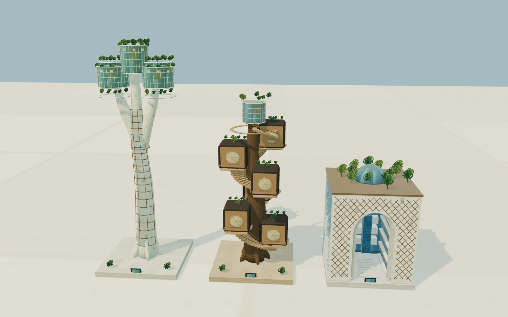
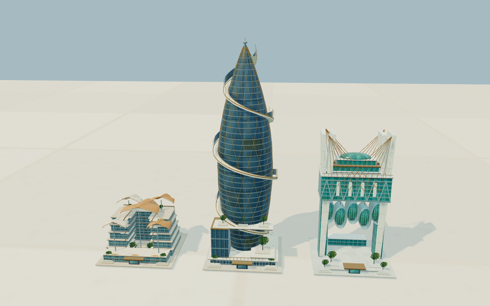
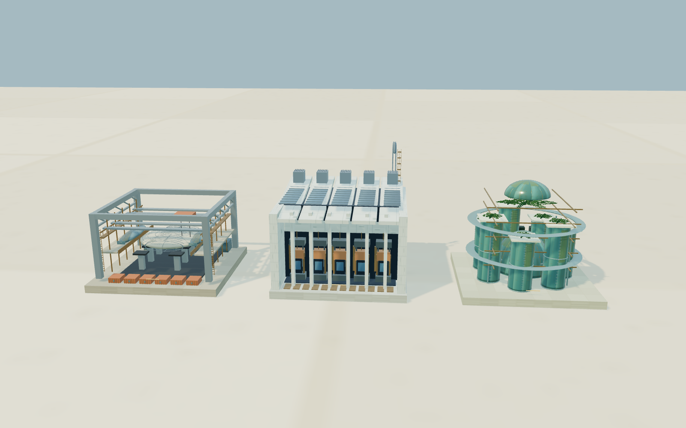
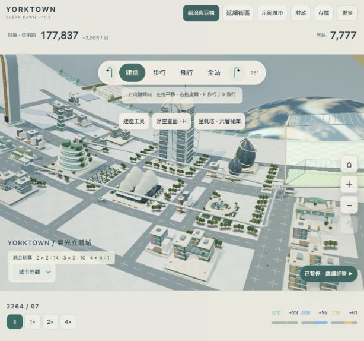
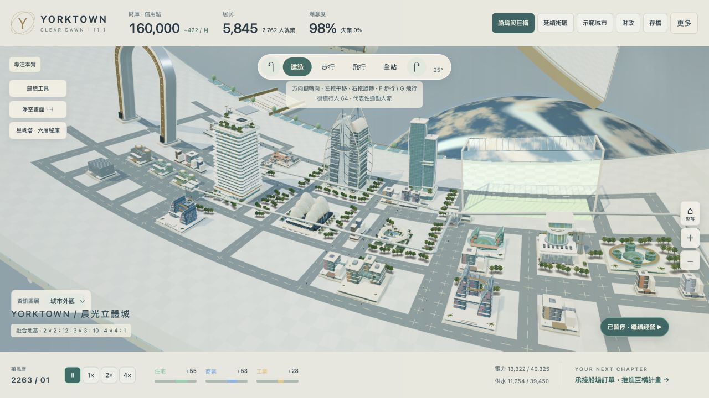
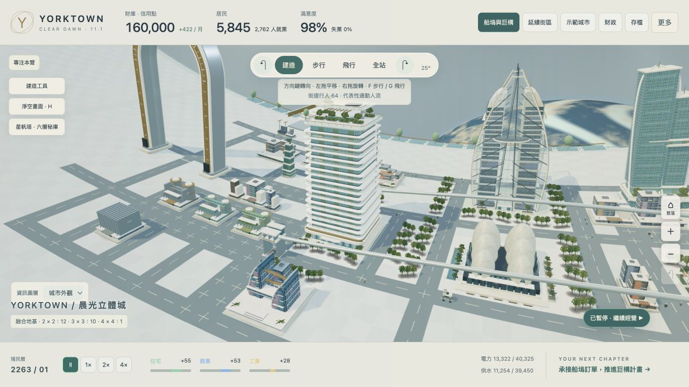
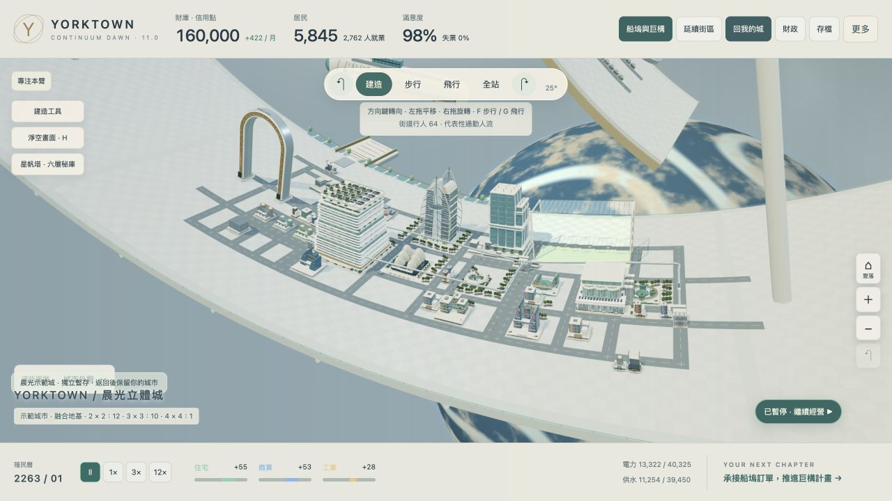
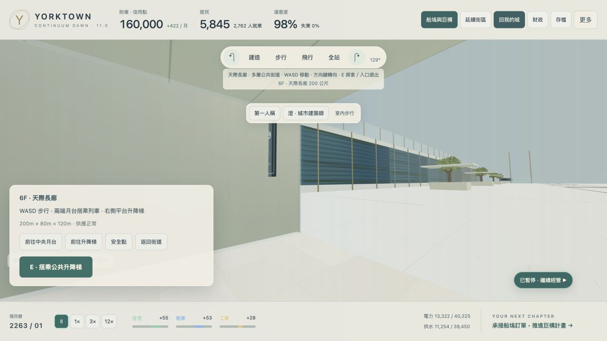
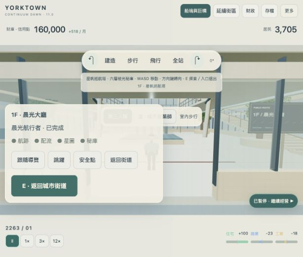

# Yorktown · 晨光立體城 v11.2.0

可經營、步行與飛行的環形太空城市。本版把住宅、商業、工業的九條分支全部換成新建築；第 5–8 階以及 1×1／2×2／3×3／4×4 地基都使用新模型，圖鑑與主城市共用幾何。第 1–4 階仍是分支前的共同建築；載入舊城市不會免費跳到最高階。

[直接開啟新版遊戲](https://rolanthhuang.github.io/SimCity_SpaceStation_YorkTown/?v=11.2.0) · [下載遊戲與原始碼](Yorktown-Branch-Evolution-v11.2.0.zip) · [離線單檔](Yorktown-Branch-Evolution-v11.2.0.html)

近景增加窗框與窗內層次、曲面幕牆、木紋與支撐樹枝、空中庭院、船體分件、工廠液壓與維修設備。也修正扇形商業屋頂表面方向錯誤造成的缺面。建築在畫面上達到足夠大小時切換完整細節，遠處保留廉價輪廓；鏡頭移動時降低畫素，停穩後恢復清晰。可從「更多 → 分支進化圖鑑」比較九種分支的第 5–8 階，以下是遊戲模型的實際渲染，非概念圖。

本輪 **127 項自動檢查全數通過**。正常示範城在 4× 下推進 18 個月；20.08% 面積的正常大城測試推進 31 個月，人口到 50,094、月淨收入 +32,886。這段大城推進時鏡頭仍在起始位置，不代表密集高階近景的持續幀率。

另將同面積測試城的分區強制設成第 8 階，暫停後定位到密集街區檢查新模型、旋轉及交通圖層；21 座完整細節模型、273 次繪製、約 326 萬提交三角形。此合成高階城財政為負，只用作渲染壓力樣本，不能當作經營成功的模板。正常近街景停穩後為 2× 解析度、約 145 萬提交三角形。沒有記錄到瀏覽器警告或錯誤，尚未完成長時間散熱、電池或全站覆蓋測試。詳見 [本輪瀏覽器紀錄](checks/branch-browser-verification.json)、[自動檢查](checks/branch-release-tests.tap)、[各模型幾何量](checks/branch-geometry-report.json)。

配樂換成已試聽接受的 **Firstlight／初見星海**原始混音。沿用單一延後載入的 HTML audio；網頁串流音檔，暫停城市時音樂仍能播放，關閉音樂或離開分頁時暫停。播放、循環與音檔雜湊均已核對，沒有新增即時音符合成計算。

## 沿用的 11.1 畫面與效能機制

2026-10-03 畫質與負擔更新：最高速度改為 **4×**，保留 1×／2×／4×；舊存檔的 12× 自動改成 4×。基準每月 8 秒，1× 一年約 96 秒、4× 約 24 秒；繁重城市會適度放慢，不累積補算造成操作堵塞。

近景恢復抗鋸齒、完整建築、2048px 快取陰影及更清晰的窗面材質。鏡頭停穩後 Retina 解析度最高 2×，一般螢幕也採 1.5× 超採樣，總畫素仍有上限；移動時暫時減少畫素，停穩便恢復清晰。住宅加寬階梯露台，增添屋頂植栽、玻璃冬園與立面翼板；金融商業增加雙帆與前庭。固定晨光不隨視角改變方向。

修正融合地基重複畫模型：4×4 曾有 16 份重疊模型，3×3 曾有 9 份，現在每座融合建築只畫一份完整模型。這是地基面積造成的重複繪製，不能據此斷言整個模擬都是 O(n²)。固定構件按材質合併繪製，星帆塔與殼館保留相同幾何细節、繪製物件數減少一半以上。鏡頭靜止且城市暫停時停止重繪；經營視角通常 8fps、成長變化 20fps、操作移動最高 30fps，步行與飛行靜止時 12fps。近處完整細節最多 96 棟、中等細節 320 棟；遠景保持輪廓與分支色系。

沿用前一輪背景月模擬與交通搜尋改善。相同 20% 城市每月計算中位數 2,823ms → 636ms，約 4.4 倍，是前一輪的 CPU 紀錄，不是本輪重新量測的耗電量；示範城 60 個月比對狀態與指標一致。詳見 [計算比對](checks/performance-cpu.json)。

前版 11.1 的 117 項自動檢查全數通過。4,068 格／20.08% 可建造面積的實際近景短測，在 4× 下 8 秒內推進三個月；配樂持續播放，沒有記錄到警告或錯誤。暫停後 1.6 秒內畫面不再重繪，音樂仍前進。這是有明確範圍的短測，不是長時間散熱／電池、所有瀏覽器或全站覆蓋認證。詳見 [11.1 驗證](checks/clear-dawn-verification.json)、[瀏覽器與配樂紀錄](checks/clear-dawn-browser.json)、[大城市供應檢查](checks/capacity-20pct-result.json)。

首次開啟為「晨光中軸街區」：5,845 名居民、160,000 信用點，包含第 6 階生態住宅、金融商業、精密工業，星帆塔、潮汐殼館、環帶花園及 200m 天際長廊。公共設施、船塢與磁浮沿中軸和支路配置，兩端保留拓展區。代表性高階建築使用正常經營與演化規則，並非固定展示道具。

啟動模板在災難關閉、自動投資與電廠自動更新開啟的條件下，連續模擬 60 個月：人口從 5,845 增至 9,235、財庫從 160,000 增至 187,967，三種代表建築均維持第 6 階以上，水電、氧氣及散熱供應保持完整。仍有局部道路壅塞，供玩家改善交通；這項檢查不代表所有政策與事件情境都永遠穩定。詳見 [五年經營紀錄](DEMO-STABILITY-v11.json)。

1. 按「1×」开始經營，從「船塢與巨構」承接下一份訂單。
2. 上方中央切換建造、步行、飛行與全站；「更多 → 晨光新街區」可定位新地標。
3. 在中軸兩端用「延續街區」框選拓展範圍，再選投資級距和確認施工。
4. 「晨光示範城」可暫時參觀模板，按「回我的城」回到原存檔。若要正式經營新模板，先匯出自己的進度，再從「存檔」建立新城市，或匯入 [晨光示範城存檔](Yorktown-Morning-Axis-Demo-v11.json)。

## 這版可以玩什麼

| 功能 | 如何使用 | 經營與探索行為 |
| --- | --- | --- |
| 立體分區建築 | 正常住宅／商業／工業發展 | 九條分支在第 5–8 階採新模型，涵蓋 1×1 至 4×4；仍依環境、時間與付費條件演化 |
| 星帆巡航塔 | 地標建造；左側「星帆塔 · 六層秘庫」 | 5×5 地基，650 個居住名額、80 個職位，月維護 120；六層樓梯、連橋、航跡檔案、配流、星圖和跳躍秘庫，進度保存 |
| 潮汐殼館 | 地標建造；更多 → 晨光新街區 | 5×5 地基，60 個職位，月維護 70；文化與周邊公共空間效益，需要真實供應与入住／就業活動 |
| 環帶花園 | 相鄰公園自然發展 | 自動投資開啟時，穩定供應及財政支持 2×2、3×3 融合；花費 2,600／9,200，月維護 70／160；植栽依供應逐漸改變 |
| 延續街區 | 上方「延續街區」，拖曳 6×6 至 32×24 格 | 保留既有建築，規劃道路、水電、氧氣、散熱與服務；依需求限制分區，再確認投資與施工 |
| 天際長廊 · THE LINE | 地標建造，拖曳長度；點建成長廊進入 | 可延長的城市複合體、側面迷彩、端部入口、六層公共街道、升降梯與中央穿梭列車 |

## 延續街區：選區後再投資

先框選接近既有城市的範圍，選「精簡延伸」「完整街區」或「旗艦更新」。三個級距施工上限為 11,000／25,000／52,000 信用點，系統只花有需求及能提供供應的份量，不會為了花完預算而塞滿分區。

預覽顯示配置圖、實際費用、新增月支出與施工後財庫；確認前不改城市、不扣款。道路先接入現有路網，基本水電、氧氣與散熱必須完成。商業／工業供給過多時不追加同類分區；新工業須有船塢貨運路徑。新的分區從空地自然成長，不直接複製成熟大樓或居民。

方案預留六個月營運資金，並以第 4 階容量檢查至少 95% 的水電／維生供應。更高階成長仍需持續擴充基礎設施。城市格局或資金改變後須重新估算；本月尚未推進時可撤銷整次施工並退款。

## 天際長廊：變長、通勤與側面迷彩

每格為 20m。長廊寬 4 格（80m）、高 120m；起始長 8–16 格（160–320m），每次再延長 40m，最長 640m。初始施工費為 5,000＋每 40m 6,000；延長一段 6,000。最高人口曾達 1,200 後解鎖，不能覆蓋既有建築或超出可建造平台。

每 40m 提供 180 個居住名額及 40 個工作容量，基本月維護為 40＋每段 55。升級另提高輸出、維護與需求。太陽能與循環設備補足部分消耗，仍需要道路、水電、氧氣與散熱；不會成為免費永久自足的建築。

長側面用目前相機的實際背景形成略帶青色差的迷彩，保留接縫與骨架。從縱向看，兩端入口、樓板和內部通道可見；進入後顯示六層公共街道。這是即時視覺表現，不是真實世界的隱形建築技術。

進入後用 WASD 步行，或「前往中央月台」「前往升降梯」沿路走到操作點，按 E 操作。升降梯可到 1–6F，中央列車抵達另一端後可以下車探索；出口返回相應端部的城市街道。兩端連接城市道路且供應、交通維護足夠時，內部列車也參與實際通勤路徑與乘客統計。側面道路不會被當成端部捷徑。

六層公共空間是可探索的街道與花園；住家與辦公模組未逐房開放。拆除任一地基會移除整座長廊，可在當月撤銷，避免產生失去端部入口的半棟建築。

## 星帆塔彩蛋

六層棱光秘庫依序完成：二樓航跡檔案 → 三樓配流工坊 → 五樓星圖室 → 六樓跳躍秘庫。提示取自檔案，完成進度存入城市。導覽沿实际樓梯與连橋移動，不直接传送；最後裂隙仍須跳躍通過。遇到迷路或跌落，可回到安全點。

## 九條環境分支

第 1–4 階為共同基礎。第 5 階開始，系統依地塊周圍八格內的公園、居住人口、就業、學校、船塢、車站，以及自身地價、污染與教育選擇方向。圖鑑的分支按鈕只切換模型預覽，實際城市仍依環境自動判斷。

下表效果為第 8 階的上限；第 5 階只有四分之一強度，第 6、7 階逐步增加。鄰近效果依實際入住／就業率、運作狀態與距離遞減，停機、火災或空置時不產生免費效益。

| 分區／分支 | 可以辨認的造型 | 主要發展條件與效果 |
| --- | --- | --- |
| 住宅：森林天冠 | 早階綠色露台；高階單一樹幹上分叉成三座空中冠庭 | 公園與低污染；增加周圍生活品質，用電 −6%，用水 +12% |
| 住宅：巨木共居 | 炭化木殼、原生巨木支柱、圓窗、螺旋階梯與共居露台 | 居民與商店聚集；鄰近住宅稅收最高 +8%，用電 −45% |
| 住宅：魔方學研城 | 中空立方體、層疊院落、門廊與格柵 | 教育與學校、低污染；鄰近合金效率最高 +12%，用電 −14% |
| 商業：層疊港灣市集 | 層疊扇形帆頂、商店窗面、連廊與植栽庭院 | 住宅客源、港口或車站可強化選擇；本身商業稅收 +20% |
| 商業：螺旋金融尖塔 | 晶體曲面塔、迴旋外骨架、玻璃穹頂與基座翼板 | 高地價與有實際就業的成熟商圈；自身商業稅收 +30%，鄰近商業最高 +10%，用電 +12% |
| 商業：懸橋商研城 | 懸橋辦公艙、索架錨點、協作穹頂與空中步道 | 學校、教育與產業；自身商業稅收 +14%，鄰近合金效率最高 +16% |
| 工業：星艦建造場 | 開放船體、建造門架、吊車、支架与維修走道 | 貨運連通，港口／車站可強化選擇；合金 +30%，污染 +12%，用電 +20% |
| 工業：巨型壓鑄工廠 | 通透廠房、一體壓鑄設備、液壓缸、天車與檢修平台 | 教育、學校與貨運；合金 +32%，污染 −22%，用電 +8% |
| 工業：循環生技 | 儲槽群、管線、維修籠梯、過濾設備、玻璃溫室與屋頂花園 | 綠色政策、公園與貨運；合金 +16%，污染 −62%，用水 −18% |

同類鄰近效果有總上限：住宅 +8%、商業 +10%、合金 +20%，避免疊滿建築後收益無限放大。分支另有每格每月維護費，第 8 階分別為住宅 4／3／6、商業 4／9／6、工業 4／7／6 信用點；這是原本高階維護費之外的支出。

## 成長、轉型與退階

| 升階 | 最少連續穩定的遊戲月 |
| --- | ---: |
| 4 → 5 | 18，分支方向還須連續確認至少 12 |
| 5 → 6 | 24 |
| 6 → 7 | 42 |
| 7 → 8 | 72 |

期間必須有正需求、足夠入住／就業率、教育、地價及至少 98% 水電與維生；工業還須連通貨運。條件中斷會重算穩定期。第 6–8 階還需完成相應船塢訂單。手動投資不能跳過時間；升階會支付真實資金、合金與零件。自動投資檢查淨收入，並保留至少六個月營運費或 5,000 信用點。

另一分支的評分持續明顯勝出 18 個月，或原分支持續不再受地段支持 12 個月，建築先退回**第 4 階共同基礎**，不會同階直接換皮。更新準備期 12 個月結束後，再重新累積 18 個月以上與投入資源，從新分支第 5 階發展。

住宅退階保留原住戶的過渡容量，再逐月調整超出基礎容量的人口，不在換造型當月把全棟住戶清空。共同基礎長期失去供應或需求 24 個月後才會閒置，住宅還必須已無住戶；供應與需求恢復六個月可重新使用。這是本版的退階／閒置狀態，不等同於尚未實作的墜毀、破損與全毀事件。

## 地基、材質與原有城市功能

- 道路三格內的連續分區可開發；不能穿過空白土地或不相關公共建築。4×4 深地基建議兩側供路。
- 2×2、3×3、4×4 自動融合需要相同分區、密度與完整地基。已分支的建築還需相同方向。融合採整片地基較低的成熟度與最慢成長進度，保留住戶過渡容量；不能靠單一成熟建築直接跳級。
- 九種分支各有四個後期造型，適用低／高密度、1×1 至 4×4 地基及遠近細節。使用實際拱架、帆形、玻璃穹頂、曲面廠房、露台、窗框、設備與入口細節，與遊戲圖鑑共用模型。
- 材質依分區與分支加入翡翠、青綠、鈷藍、陶土、香檳金與藍紫色。電廠、水循環及其他公共設施也有獨立材質色系；主光仍沿用固定暖金晨光與冷色補光。
- 原有公共設施四階及至 3×3 的融合、電廠自動更新、船塢訂單、巨構、訪客船與傳送門仍可使用。
- 只需放置磁浮車站，軌道自動連到其他車站，實際通勤會轉移；可手動拆除與明確恢復連線。

## 操作與存檔

上方中央為建造、步行、飛行、全站；←／→ 持續 360° 轉向，↑／↓ 調整俯仰。建造左拖平移、右拖旋轉、滾輪縮放；施工工具左拖框選。WASD 移動，F／G 切換步行／飛行。飛行 Space 上升、C 下降、Shift 加速；步行 V 切換人稱、T 選角色，E 互動／搭乘／進入。P 暫停，1／2／3 切換速度，H 淨空畫面，Cmd/Ctrl Z 撤銷本月施工。

新地標可從「更多 → 晨光新街區」定位，舊有垂直居住塔三層迷宮仍保留。通常分區建築提供經營與外部造型，沒有重複的單間中控室。

v11 使用獨立自動／手動存檔，不改寫 v10 的儲存。可透過「存檔 → 匯入」讀取 v2–v9 城市格式；本版為存檔 v9／tiles-v5。匯入舊城市時保留原格局，新地標不自動覆蓋城市。示範城在獨立頁面暫存中執行，參觀進度不覆蓋自己的城市；返回時重新載入原存檔。需要正式經營新街區可另建新城市；請先匯出要保留的進度。

本版使用《Firstlight／初見星海》，約 2 分 20 秒。第一次操作後柔和開始播放，從「更多 → 配樂」開關；關閉狀態會記住。離開分頁時暫停，返回後接續。網頁入口約 1,064 KiB，先載入城市，再串流 MP3；離線單檔約 4,698 KiB，包含相同音檔與三維函式庫。素材及雜湊見 [Audio/CREDITS.md](Audio/CREDITS.md)。

## 驗證與開發

[11.1 驗證](checks/clear-dawn-verification.json) 記錄 v11.1 的檢查與畫面設定。[CONTINUUM-CITY-VERIFICATION.json](CONTINUUM-CITY-VERIFICATION.json) 保留 v11 原先的城市、配樂、模板 60 個月經營及介面檢查證據；以下室內畫面來自該輪。它們不是 v11.1 重新測試所有功能的宣告。

這版是可玩的網頁原型。未完成滿站效能評定、所有財政情境的長期校準、電影畫質等效評定或原生手機商店發布。StarFleet 造訪／墜毀與戰鬥仍未加入。

原始碼在下載包中；安裝 `package-lock.json` 中的開發依賴後，以 `npm run build` 建置、`npm test` 檢查。實作說明見 [ARCHITECTURE.md](ARCHITECTURE.md)，素材與套件說明見 [RIGHTS.md](RIGHTS.md)。
