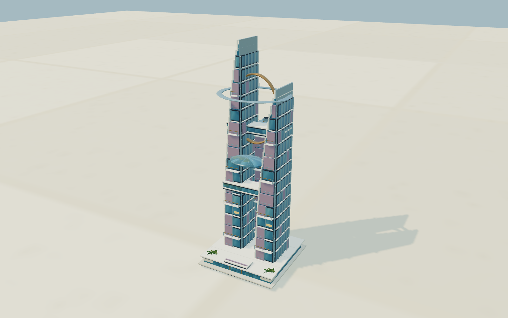
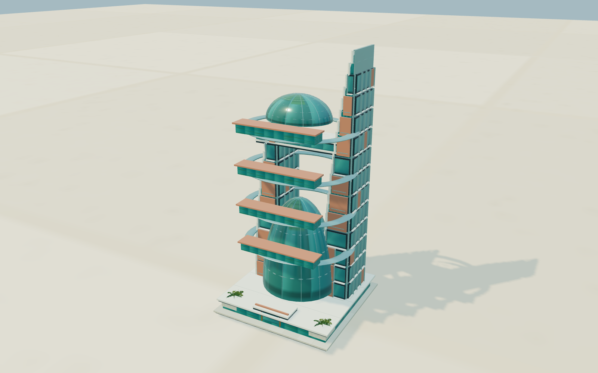
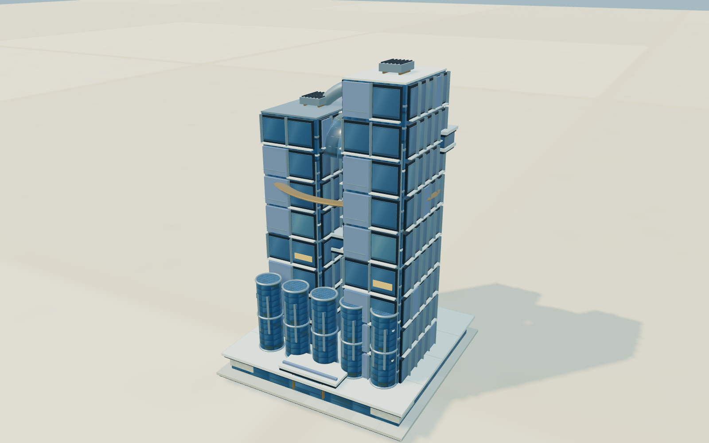

# Yorktown · 晨光精工 v10.1.0

可經營、步行與飛行的環形太空城市。本版把住宅、商業、工業的第 5–8 階改成各三條環境分支，造型與經營效果一起變化；遊戲不載入背景配樂。

## 開始玩

[直接開啟網頁遊戲](https://rolanthhuang.github.io/SimCity_SpaceStation_YorkTown/) · [下載完整遊戲與原始碼包](Yorktown-Chromatic-City-v10.1.0.zip)

本版補上四面窗洞、玻璃分格、纖細欄杆、曲面帆肋、穹頂骨架、入口與屋頂設備；電廠、水循環及公用設施也加入管線、閥件和維修平台。象牙白搭配青綠、鈷藍、陶土及藍紫材質，使用固定晨光與環境反射。更多選單已修正被其他控制區遮擋的問題。圖鑑可輸出實際模型 PNG。

開啟 [Yorktown-Chromatic-City-v10.1.0.html](Yorktown-Chromatic-City-v10.1.0.html)，按「繼續經營」或「1×」。三維程式已包含在單檔 HTML 中，可離線使用。`index.html`、`simcity.html`、`showcase.html`、`SimCity/template.html` 與此入口由同一次建置生成，內容相同。

首次開啟提供已有地基、公共設施、磁浮、巨構的展示城市，方便查看與操作。這些起始資產是預設展示條件；「存檔」可建立小型聚落或空白城市。更多 → **分支進化圖鑑** 可旋轉比較三種分支，或查看某條路徑從第 1 階到第 8 階的實際模型。

## 九條環境分支

第 1–4 階為共同基礎。第 5 階開始，系統依地塊周圍八格內的公園、居住人口、就業、學校、船塢、車站，以及自身地價、污染與教育選擇方向。圖鑑的分支按鈕只切換模型預覽，實際城市仍依環境自動判斷。

下表效果為第 8 階的上限；第 5 階只有四分之一強度，第 6、7 階逐步增加。鄰近效果依實際入住／就業率、運作狀態與距離遞減，停機、火災或空置時不產生免費效益。

| 分區／分支 | 可以辨認的造型 | 主要發展條件與效果 |
| --- | --- | --- |
| 住宅：生態庭院 | 綠色露台、環庭、玻璃穹頂 | 公園與低污染；增加周圍生活品質，用電 −6%，用水 +12% |
| 住宅：生活共構 | 陶土色横向翼樓、開放庭院、空中街道 | 居民與商店聚集；鄰近住宅稅收最高 +8% |
| 住宅：學研居住 | 藍紫雙翼、光帆、外骨架、資料環 | 教育與學校、低污染；鄰近合金效率最高 +12%，用電 −14% |
| 商業：港灣集市 | 金色低層拱廊、棚頂、市集環 | 住宅客源、港口或車站可強化選擇；本身商業稅收 +20% |
| 商業：星際金融 | 香檳金雙帆、巨型拱架、連橋 | 高地價與有實際就業的成熟商圈；自身商業稅收 +30%，鄰近商業最高 +10%，用電 +12% |
| 商業：創研商務 | 青綠穹廊、紫色協作環、翼樓 | 學校、教育與產業；自身商業稅收 +14%，鄰近合金效率最高 +16% |
| 工業：重載物流 | 赭金貨庫、巨型拱形廠房、吊運門架 | 貨運連通，港口／車站可強化選擇；合金 +30%，污染 +12%，用電 +20% |
| 工業：精密智造 | 鈷藍製造翼、機械拱架、懸環 | 教育、學校與貨運；合金 +32%，污染 −22%，用電 +8% |
| 工業：循環生技 | 翡翠儲槽、溫室、過濾環、屋頂花園 | 綠色政策、公園與貨運；合金 +16%，污染 −62%，用水 −18% |

同類鄰近效果有總上限：住宅 +8%、商業 +10%、合金 +20%，避免疊滿建築後收益無限放大。分支另有每格每月維護費，第 8 階分別為住宅 4／3／6、商業 4／9／6、工業 4／7／6 信用點；這是原本高階維護費之外的支出。

## 成長、轉型與退階

| 升階 | 最少連續穩定的遊戲月 |
| --- | ---: |
| 4 → 5 | 18，分支方向還須連續確認至少 12 |
| 5 → 6 | 24 |
| 6 → 7 | 42 |
| 7 → 8 | 72 |

期間必須有正需求、足夠入住／就業率、教育、地價及至少 98% 水電與維生；工業還須連通貨運。條件中斷會重算穩定期。第 6–8 階還需完成相應船塢訂單。手動投資不能跳過時間；升階會支付真實資金、合金與零件。自動投資檢查淨收入，並保留至少六個月營運費或 5,000 信用點。

另一分支的評分持續明顯勝出 18 個月，或原分支持續不再受地段支持 12 個月，建築先退回**第 4 階共同基礎**，不會同階直接換皮。更新準備期 12 個月結束後，再重新累積 18 個月以上與投入資源，從新分支第 5 階發展。

住宅退階保留原住戶的過渡容量，再逐月調整超出基礎容量的人口，不在換造型當月把全棟住戶清空。共同基礎長期失去供應或需求 24 個月後才會閒置，住宅還必須已無住戶；供應與需求恢復六個月可重新使用。這是本版的退階／閒置狀態，不等同於尚未實作的墜毀、破損與全毀事件。

## 地基、材質與原有城市功能

- 道路三格內的連續分區可開發；不能穿過空白土地或不相關公共建築。4×4 深地基建議兩側供路。
- 2×2、3×3、4×4 自動融合需要相同分區、密度與完整地基。已分支的建築還需相同方向。融合採整片地基較低的成熟度與最慢成長進度，保留住戶過渡容量；不能靠單一成熟建築直接跳級。
- 九種分支各有四個後期造型，適用低／高密度、1×1 至 4×4 地基及遠近細節。使用實際拱架、帆形、玻璃穹頂、曲面廠房、露台、窗框、設備與入口細節，與遊戲圖鑑共用模型。
- 材質依分區與分支加入翡翠、青綠、鈷藍、陶土、香檳金與藍紫色。電廠、水循環及其他公共設施也有獨立材質色系；主光仍沿用固定暖金晨光與冷色補光。
- 原有公共設施四階及至 3×3 的融合、電廠自動更新、船塢訂單、巨構、訪客船與傳送門仍可使用。
- 只需放置磁浮車站，軌道自動連到其他車站，實際通勤會轉移；可手動拆除與明確恢復連線。

## 操作

上方中央保留建造、步行、飛行、全站。←／→ 可持續轉向 360°，↑／↓ 調整俯仰；建造左拖平移、右拖旋轉、滾輪縮放。WASD 移動，F／G 切換步行／飛行；飛行 Space 上升、C 下降、Shift 加速。

步行 V 切換第一／第三人稱，T 選角色；E 與居民互動、搭乘 Scooter／運輸犬、操作傳送門。澄步行、迅跳躍、翼短程飛行。保留彎曲甲板上方的跟隨鏡頭與等價質量碰撞滑開。

只有垂直居住塔提供三層迷宮與樓梯探索，其他建築有經營功能。分支的外部連橋、屋頂平台本版為建築造型，不另增加室內或屋頂行走路線。P 暫停，1／2／3 切換速度，H 淨空介面，Cmd/Ctrl Z 撤銷本月施工。

## 保存與驗證

本版沿用 v10 分支版的自動／手動存檔，不覆蓋 v9。可匯入 v2–v7 舊資料及 v8 新資料；本版網頁為 v10.1.0、存檔格式為 v8／`tiles-v5`。舊版高階建築首次匯入時取得一個分支身份，保留原階級與人口；後續轉型遵守等待與退階規則。

[CHROMATIC-CITY-VERIFICATION.json](CHROMATIC-CITY-VERIFICATION.json) 記錄本輪程式檢查、五年經營模擬、實際瀏覽器畫面、無配樂檢查與五個入口的雜湊。圖片是與遊戲共用的實際模型渲染；本版不代表電影畫質。尚未做電影畫質等效評定、大型滿站效能測試或所有經濟情境的長期平衡校準。

開發：`npm run build`；程式檢查：`npm test`。實作說明見 [ARCHITECTURE.md](ARCHITECTURE.md)，套件與素材說明見 [RIGHTS.md](RIGHTS.md)。
