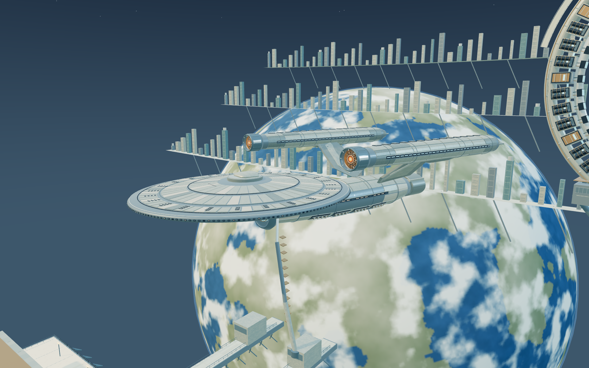
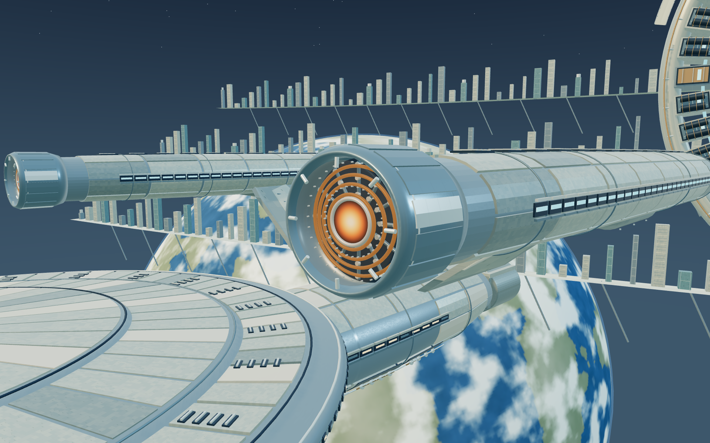
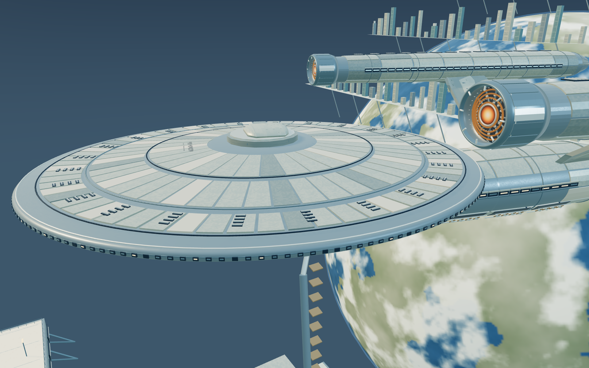
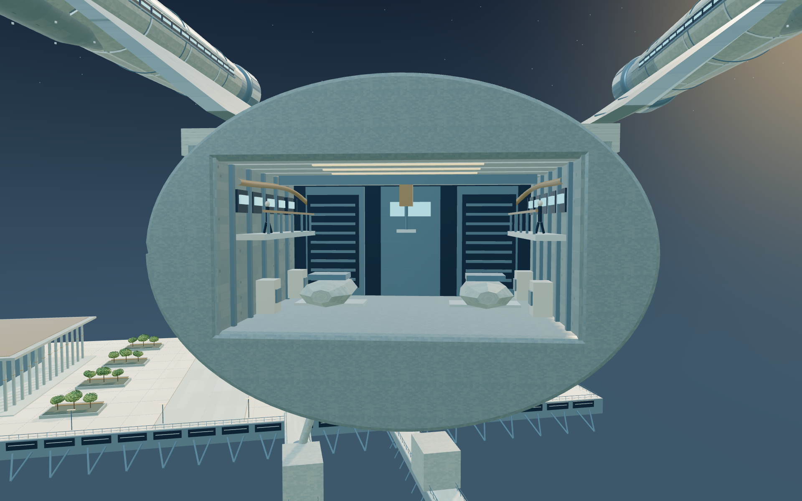

# Yorktown 遠航近景樣板 0.1.1

這是與主遊戲分離的實際 Three.js / WebGL2 樣板。包含星冠級旗艦、遠航中繼巨構，以及一段晨光觀景平台。正式遊戲的財政、人口與存檔不受影響。

## 觀賞方式

直接開啟 `Yorktown-Orbital-Closeup.html`，或以本機靜態伺服器開啟 `index.html`。整份 HTML 包含程式與函式庫，貼圖在本機生成，不需要下載音樂、模型、字體或外部圖片。

- **全景**：拖曳旋轉，滾輪縮放，方向鍵轉向，右拖平移。
- **飛行近景**：WASD 平移，Q / E 升降；也能旋轉、放大觀看。這是觀赏相機，不是主遊戲的完整自由飛行角色。
- **街道**：WASD 在觀景平台步行，拖曳及方向鍵看四周；相機維持甲板上方並避開花圃。
- **近看引擎／船殼細節／近看機庫**：旗艦的三個細節取景；中繼巨構提供線圈近景。都可繼續旋轉。
- **播放訪港**：有限時長的進港、靠泊與機庫開啟演出。
- **中繼充能**：有限時長的能源場與穿梭艇穿越演出。
- **拍照**：輸出目前模型的 1920 × 1200 PNG，不含操作介面。

## 樣板範圍

旗艦使用階梯甲板、獨立厚裝甲、凹入窗帶與設備槽、實心翼狀支架、連續收束且封閉的引擎艙。前端能源核心與能量光圈置於有厚度的金屬外罩內，有固定承力肋、絕緣座與不透光隔板；淺光學罩取代膨脹半球罩，船尾不再使用方塊塞住管口。長軸能源通道與場控制構件採用科幻曲速艙的視覺語彙，不使用航空渦輪葉片。開放機庫有真正的地板、天花、後艙壁、兩側維修走道、管線、設備架、起重裝置與兩架穿梭艇。巨構包含外環、交叉桁架、線圈盒、實際繞線、控制艙、維修欄杆與啟動場。

遠方城市與行星是此樣板的背景造景，不執行城市經濟模擬。沒有整艦內部探索、星系模擬、施工經費或維護費機制。這些屬於外觀確認後的後續整合。

## 效能設計與驗證界線

固定零件依材質合併，保留幾何、紋理與法線。遠距旗艦使用獨立較低細節模型。相機移動暫時使用較低解析度，停止後恢復較銳利畫面。靜止後停止繪圖；隱藏分頁停止排程。演出及相機操作最多 24 / 30 FPS，不建立永久動畫循環。

本機操作檢查與繪图次數列在 `checks/browser-verification.json`。短時驗證不代表長時間熱量、耗電或主遊戲整合效能已通過。主遊戲仍為 11.2.1。

## 重建

使用已安裝的 Node.js 與 esbuild 0.25.9：`npm test` 檢查封閉船殼、裝甲厚度、鏡像翼板、引擎／機庫內部遮擋及實際靜態合併，再以 `npm run build` 重建。

Three.js 授權位於 `THIRD-PARTY-LICENSES.txt`。場景模型與程序材質由此樣板生成，不包含電影截圖或電影音樂。

## 實際模型取景

下列圖片均由此樣板的 WebGL 畫面輸出；未使用概念生成圖取代模型。

